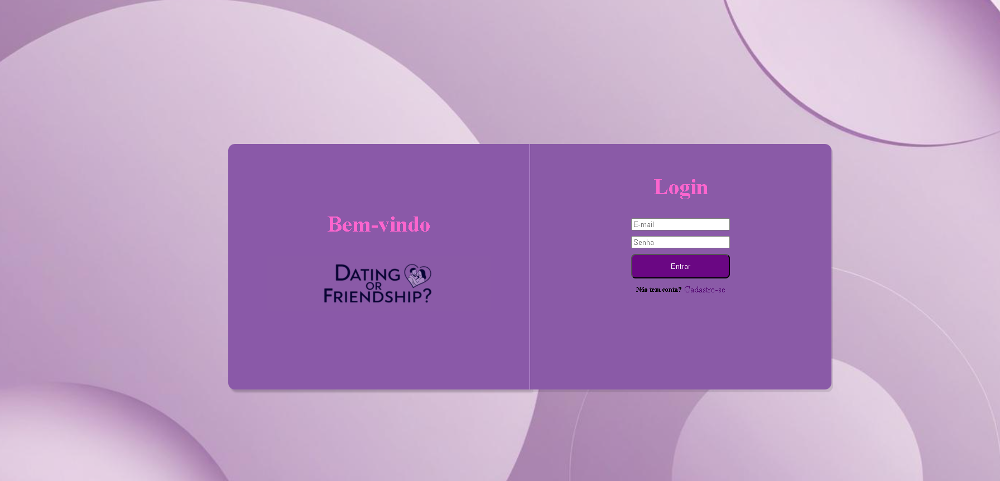
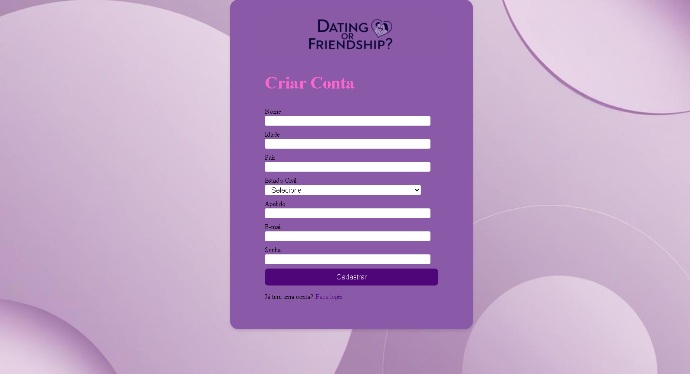
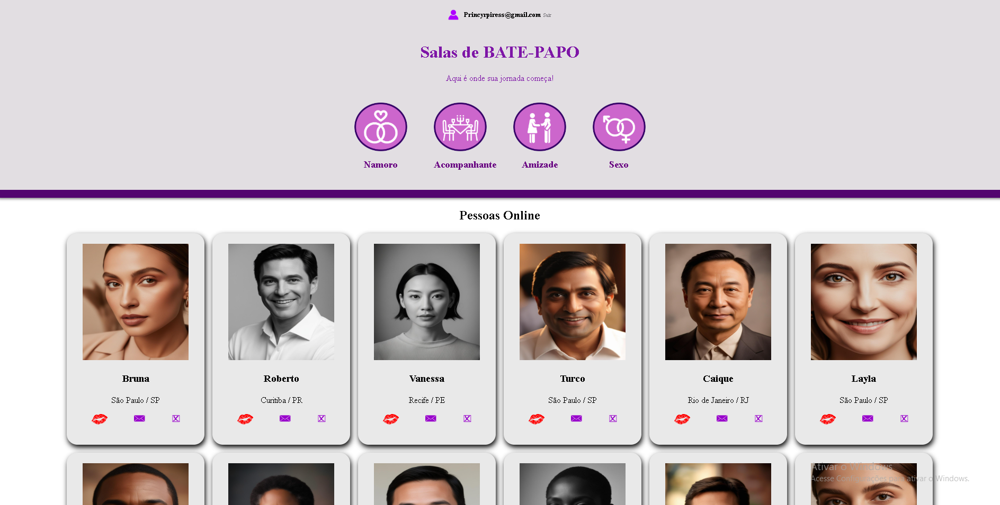
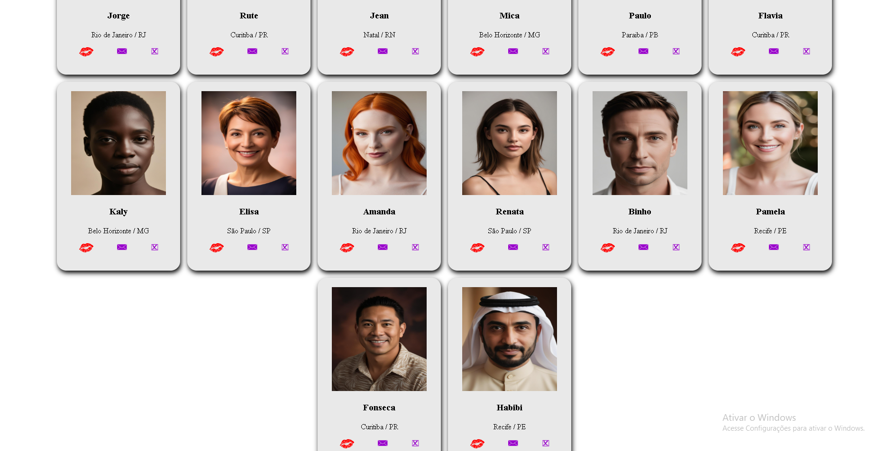

# 💘 Projeto Namoro

Esse é um projeto de uma plataforma de relacionamentos desenvolvida com **React**, **Vite** e muito carinho! 💻✨

A ideia é proporcionar um espaço moderno, bonito e funcional para que pessoas possam se conectar e, quem sabe, encontrar o amor da vida. ❤️

## 🚀 Funcionalidades

- Tela de login e cadastro
- Página principal com sugestões de perfis
- Design moderno e responsivo
- Animações suaves com hover e efeitos visuais

## 🛠️ Tecnologias Utilizadas

- [React](https://reactjs.org/)
- [Vite](https://vitejs.dev/)
- [Tailwind CSS](https://tailwindcss.com/) *(opcional, se estiver usando)*
- JavaScript
- HTML e CSS

## 📁 Estrutura do Projeto

## 📸 Print da Tela

*(Coloque aqui prints bonitos da sua aplicação)*

## 📌 Status do Projeto

> 🚧 Projeto em desenvolvimento... mas já funcionando! Em breve novas melhorias e funcionalidades. 💡

## 💡 Autor(a)

Feito com 💜 por [@Princyrr](https://github.com/Princyrr)

## 📸 Print da Tela

### Tela de Login

### Tela de Cadastro

### Telas da página principal (personagens feitos com Inteligência Artificial)

---

